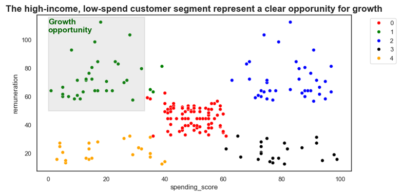
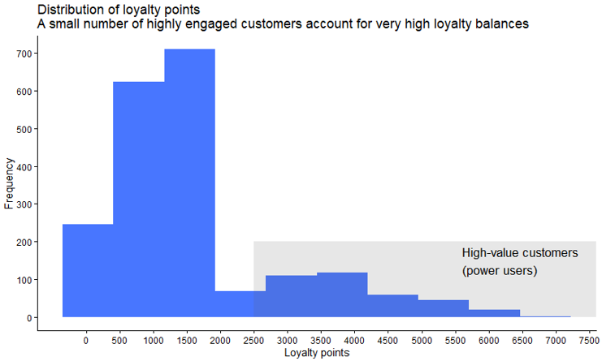
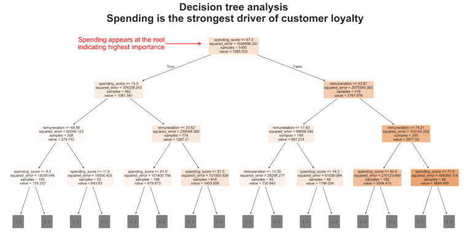

# loyalty-analytics-retention-growth
Predictive analytics project exploring customer loyalty, retention and growth opportunities. Using customer segmentation, regression modelling and sentiment analysis to identify high-value customers, uncover engagement drivers and develop data-driven recommendations to improve retention, customer value and long-term growth.

# From Loyalty Data to Business Action

## Overview
This project explores how customer analytics can be used to improve retention, strengthen loyalty and identify growth opportunities. Using predictive analytics, customer segmentation and sentiment analysis, I investigated the factors influencing customer loyalty and translated findings into practical business recommendations.

## Business Problem
Customer loyalty is rarely distributed evenly across a customer base. Organisations need to understand which customers generate the most value, what drives their loyalty, and where there are opportunities to increase engagement.

The objective of this project was to identify high-value customer segments, understand the drivers of loyalty, and uncover opportunities to improve retention and long-term customer value.

## Approach
- Cleaned and prepared customer, demographic and review datasets
- Conducted exploratory data analysis (EDA)
- Created customer loyalty segments using K-Means clustering
- Built Multiple Linear Regression models to identify loyalty drivers
- Used Decision Tree analysis to improve interpretability
- Performed sentiment analysis on customer reviews
- Created stakeholder-focused visualisations to communicate findings

## Key Insights
- Customer loyalty was highly concentrated among a small group of highly engaged customers
- Spending behaviour was a stronger predictor of loyalty than demographic characteristics
- A high-income, low-engagement customer segment represented a significant growth opportunity
- Customer feedback highlighted opportunities to improve engagement and retention

## Recommendations
- Introduce a tiered loyalty programme with currency‑style rewards, unlocked through sustained engagement. Top tiers offer partial discounts or exclusive access, retained by meeting loyalty thresholds. 
- Use targeted, conditional incentives aligned to behaviour, including off‑peak, time-limited offers and milestone-based rewards. 
- Expand text analytics beyond polarity to identify engagement friction and refine marketing messaging around ease of play, progression and variety. 

## Tools Used
Python, R, Customer Segmentation, K-Means Clustering, Multiple Linear Regression, Decision Trees, Sentiment Analysis, Data Visualisation, Predictive Analytics, Customer Insights

## Key Visuals
### Customer Segmentation
[

### Loyalty Distribution
[

### Drivers of Loyalty
[

## What I'd Do Next
This project used sentiment analysis to understand overall customer opinion, but only at a polarity level. As a next step, I would expand the text analytics approach to identify specific drivers of customer engagement and frustration. This would help uncover themes related to ease of play, progression and variety, enabling more targeted marketing messages and loyalty strategies.
